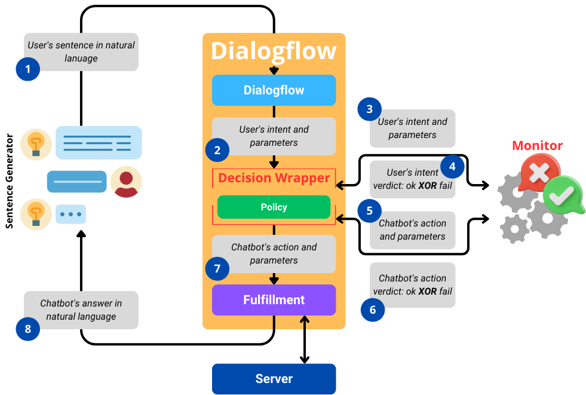

## Dialogflow

To instantiate RV4Chatbot in Dialogflow a new component is needed: the **policy**.



To make a Dialogflow agent monitorable you should follow this guide:

1. Create your own agent and test it (also with webhook!);

2. Export as zip file;

3. Call the instrumenter script on the exported agent with the monitor URL and the URL on which the policy will listen;
   ```bash
   python instrumenter.py -i ExampleAgent.zip -o ExampleAgentMonitored.zip -url POLICY_URL -murl MONITOR_URL -level N
   ```

4. Create a new Dialogflow agent and restore the agent monitorable present in the `output` folder;

5. Launch the policy, you are all set!

