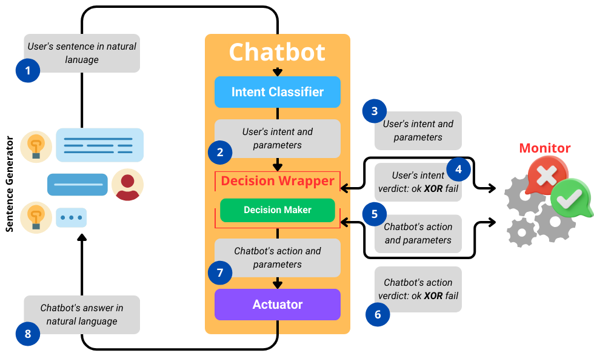

# RV4Chatbot

RV4Chatbot aims to make modern intent-based chatbots monitorable at runtime adding only a policy component to the original architecture.

The RV4Chatbot high level architecture is presented in the figure. The flow is:

1. The user sends a message on the chat;
2. The intent classifier of the chatbot identifies an intent and extracts the entities (if any);
3. Then, depending on the chatbot implementation there is decision wrapper deciding the answer. In this context the message is sent to the monitor;
4. An answer is returned by the monitor;
5. The decision wrapper decides a next action to be performed and it sends the decision to the monitor;
6. An answer is return by the monitor;
7. The chosen action is sent to the Actuator that will execute the action;
8. A message is sent back to the chat.

In case of error at any time of the execution the action is set to an error action and a message of error is sent to the user.

In this repository are present two possible instantiation of RV4Chatbot using **Dialogflow** and **Rasa**.

You can also find two working scenarios:

1. One chatbot in the domestic violence domain;
2. One chatbot in the factory robot placement domain.
